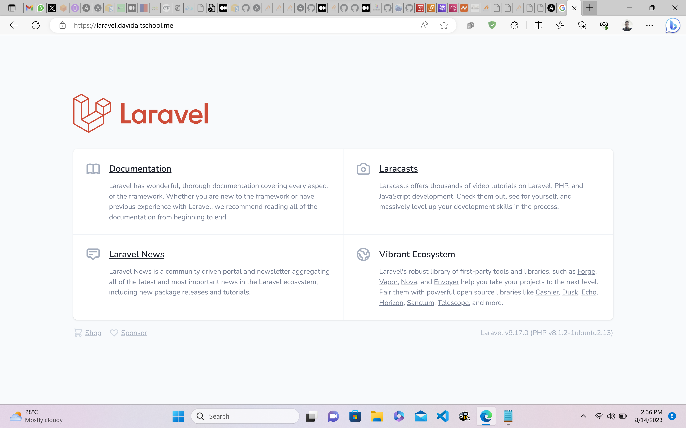

# Creating a Highly Available, Two-tier Laravel Web Application Using Ansible
## 1. Setting Up Ansible Controller
An EC2 instance was used as the ansible controller for this task. An IAM role with the following policies was attached to the ansible controller EC2 instance:
- AmazonVPCFullAccess
- AmazonEC2FullAccess
- AmazonRoute53FullAccess
- AwsCertificateManagerFullAccess

These policies were attached to ensure that the ansible-controller EC2 instance had full access to the AWS services used in this task. Using an EC2 instance in the target account where the application was to be set up also ensures that the Secret Access Keys and Account Keys weren't specified in the task.
The following packages were also installed on the Ansible controller:
- [Ansible](https://docs.ansible.com/ansible/latest/installation_guide/intro_installation.html)
- Python3
- [Pip3](https://www.educative.io/answers/installing-pip3-in-ubuntu)
- Boto3 - necessary package that enables the ansible controller to interact with AWS
  ```
  sudo pip install boto3
  ```
- unzip to unzip the AWS CLI zip file during installation
  ```
  sudo apt install unzip -y
  ```
- [AWSCLI v2](https://docs.aws.amazon.com/cli/latest/userguide/getting-started-install.html)

## 2. Creating Inventory
A __host_vars__ directory containing two subdirectories (__remote-host__ and __localhost__) was created. Each subdirectory had a __vars.yml__ file containing specified variables for the tasks run on each node.

## 3. Creating Roles
  Three roles were used for this task: __VPC__, __EC2-Temp__ and Final. Each of these roles was created under the __roles__ directory using 
  the ansible-galaxy utility.
  ```
  mkdir roles
  ansible-galaxy init [role name] -p roles/
  ```
  ### VPC Role
  The VPC role had tasks that set up the following:
  - A VPC
  - Four subnets: two private and two public subnets each
  - An internet gateway to provide access to the internet for the public subnets
  - A NAT gateway to provide internet access for the private subnets
  - A route table each for the private and public subnets
  - A security group for the private instances which allowed HTTP and HTTPs access only from the load balancer
  - A security group for the application load balancer that allows HTTP and HTTPs access from the internet
  - Creation of a template instance that was to be used to create the target AMI for our autoscaling group
  - Import a private key generated on the ansible controller into AWS and attach it as the key for the newly created instance for SSH access
    
  ### EC2-Temp Role
  The EC2-Temp role was run using the newly created instance that was created with the VPC role as the target. To run the role, first, the 
  database password for the MySQL database was encrypted using ansible vault.
  ```
  ansible-vault encrypt-string 'dbpassword' --name db_pass
  ```
  The vault-encrypted string was inserted into the __vars.yml__ file under the host_vars/remotehost/ path.
  The EC2- Temp role also did the following:
  - Clone the target Git repository with the Laravel Application
  - Install necessary dependencies for the Laravel Application
  - Set up MySQL user and database for the Laravel Application
  - Setup an Apache webserver configured with a customized configuration file and to serve the right application path
    
   ### Final Role
  The Final Role was run from the Ansible controller and had tasks that did the following:
   - Created a new AMI using the configured remote instance on which the Laravel Application was running
   - Set up autoscaling and target groups
   - Created an application load balancer and attached it to the target instances created by the autoscaling group
   - Setup SSL certificate with ACM manager using Ansible shell module 
   - Setup a Route 53 Hosted Zone with Alias record pointing to a domain name (laravel.davidaltschool.me)

  The project was run using the __ansible-playbook__ command.
  ```
  ansible-playbook main.yml
  ```
  The final Laravel Application ran on the desired number of instances (2) and was served by an application load balancer with an SSL 
  certificate attached to redirect HTTP traffic to HTTPs.


