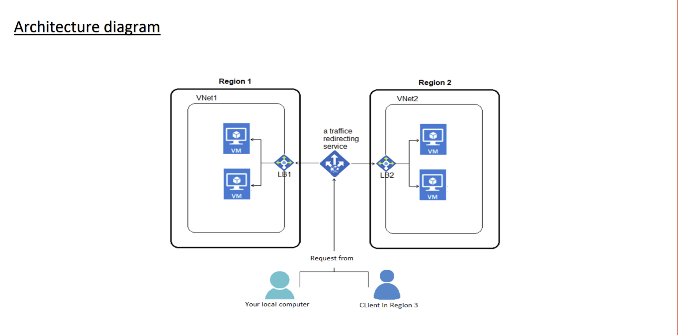
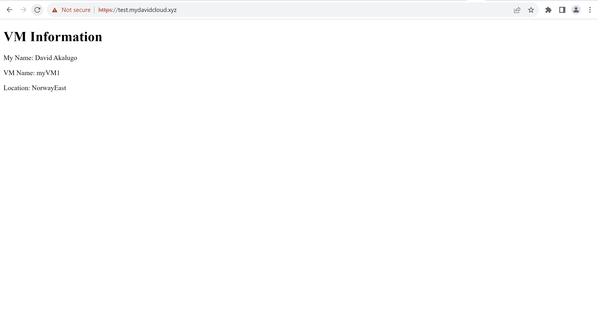
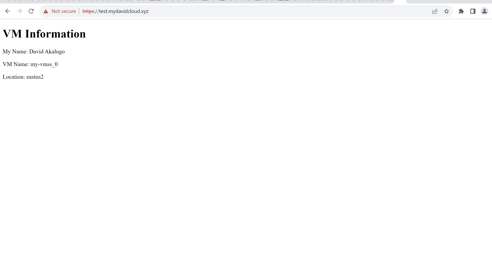
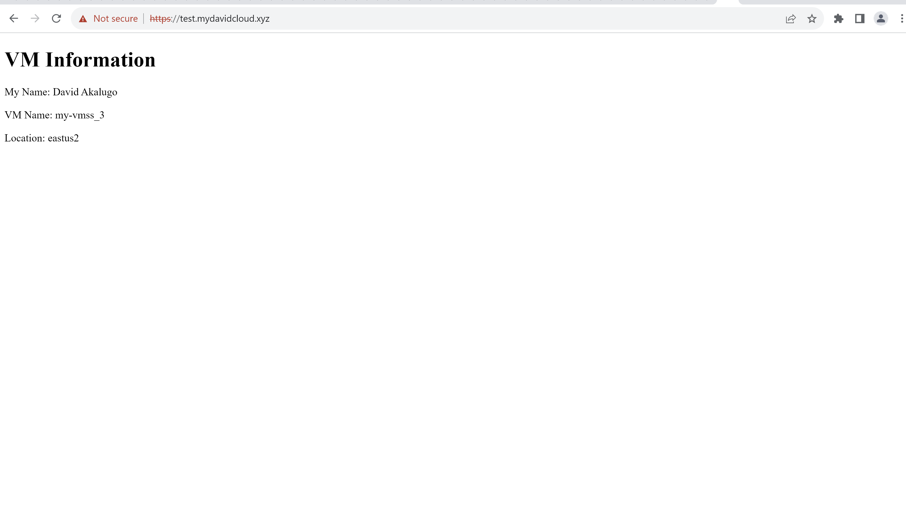
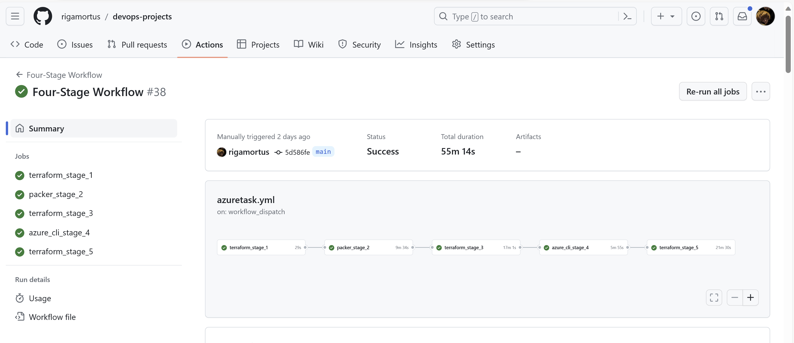

# Creating a Highly Available Two-Tier Architecture Website on Azure with DNS Geo-Routing Using Terraform and Github Actions

The primary objective of this project was to deploy and configure website architecture on Microsoft's Azure platform. Rather than implement this infrastructure manually using the Azure portal, the website infrastructure was automated using Terraform for provisioning and Github Actions as the CI/CD tool.

Azure services used in this project include resource groups, virtual machines, virtual networks and subnets, load balancers and traffic manager. Architecture was provisioned in two regions (__East US 2__ and __Norway East__) to ensure resiliency and availability. A geo-routing DNS rule was also implemented to route users to the closest region to reduce latency and improve performance.

## Website Architecture



To host the website, two virtual networks with CIDRs "192.168.0.0/16" (__East US 2__) and "10.0.0.0/16" (__Norway East__) were created. Each virtual network had two subnets each with a subnet mask of "/24". A load balancer for each region was created and served as the Azure endpoint for the traffic manager. An Azure DNS zone "mydavidcloud.xyz" was also created with CNAME records that pointed the subdomain "__test.mydavidcloud.xyz__" to the address for the traffic manager profile . A virtual machine scale set with two instances in East US 2  and two virtual machines in Norway East hosted the website.

## SSL Certificate

- A self-signed certificate was created using OpenSSL. The __.key__ and __.crt__ files were converted to __.pfx__ which is the format required for SSL termination in Azure Application Gateway.

```bash
openssl req -new -newkey rsa:2048 -days 365 -nodes -x509 -keyout davidcloud.key -out davidcloud.crt

openssl pkcs12 -export -out davidcloud.pfx -inkey davidcloud.key -in davidcloud.crt
```

## Azure Service Principal

- First, an Azure Service Principal was created with owner permissions to grant Terraform and Github Actions access to my Azure for Students subscription using the Azure CLI on my command line.

```bash
az ad sp create-for-rbac --query "{ client_id: appId client_secret: password, tenant_id: tenant }"
```

The above command yielded Client Secret and Client ID. Tenant ID and Subscription ID were also noted.

## CI/CD

Github Actions was my preferred CI/CD tool to trigger the terraforn files. In the workflow file (__/.github/workflows/azuretask.yml__), I implemented a five-stage task. The first four stages were configured to execute on push to the main branch while the final stage (resource destruction) only executes after entry of the passphrase '__David__'.

### Stage One

- Terraform State Files: An Azure container (__mytfgithub__) was used to store the teraform state files for the task. I created a resource group (__my-f23-rg__) and a storage account (__tfstatemy12__) to host my container.

This was used as the __backend__ in my Terraform provider block:

```HCL
  backend "azurerm" {
    resource_group_name  = "my-f23-rg"
    storage_account_name = "tfstatemy12"
    container_name       = "mytfgithub"
    key                  = "terraform.tfstate"
  }
```

- My Azure subscription details were also specified in my Terraform Azure provider block with client secret hidden using a variable.

```HCL

provider "azurerm" {
  features {}
  client_id       = "c9d0477d-c277-401a-9a23-fd3644ebc3e7"
  client_secret   = var.client_secret
  tenant_id       = "03024f44-e3ad-4b2c-b85b-d1a744b0b70f"
  subscription_id = "6ea6f9f7-0a28-45a1-b63d-c045d73026f2"
}
```

- All resources for the website architecture in East US 2 were implemented in Stage One except the virtual machine scale set. These include:

1. A virtual network
1. Two subnets
1. Network interface for the virtual machine scale set
1. An application gateway with an SSL certificate and a redirection rule which redirects HTTP traffic to HTTPs
1. A NAT gateway for internet access for the VMSS subnet (VMSS were placed in a private subnet)
1. Two public IPV4 adresses (One each for the AGW and NAT Gateway)
1. A Network Security Group associated with the AGW subnet to allow access from Azure Loadbalancer and HTTP and HTTPS access.
1. Shared Image Gallery and Shared Image Version.
1. A Traffic Manager Profile with Geo Routing Implemented
1. A Traffic Manager Azure Endpoint pointing to the public IPV4 address associated with the AGW in East US 2 and that routes traffic from North and South America to the East US 2  region.
1. A key vault to store the SSL certificate
1. User Managed Identity and Key Vault access policies that enable the AGW to retrieve the certificate.

- In the Github Actions Workflow file, __Stage One__  was implemented using an Ubuntu runner and actions "__azure/login@v1__", "__hashicorp/setup-terraform@v1__", and "__actions/checkout@v2__".

The Terraform files were applied with environment variables retrieving my Azure subscription details from secrets stored in Github Actions:

```bash
 terraform init -backend-config="subscription_id=${{ secrets.ARM_SUBSCRIPTION_ID }}" -backend-config="client_id=${{ secrets.ARM_CLIENT_ID }}" -backend-config="tenant_id=${{ secrets.ARM_TENANT_ID }}" -backend-config="client_secret=${{ secrets.ARM_CLIENT_SECRET }}"

terraform apply -auto-approve
```

### Stage Two: Packer Image Build

- Since Terraform's __azurerm_image__ resource cannot build images without defects, I opted for another Hashicorp tool: __Packer__.

- A JSON file (__azurepacker.json__) was created for the build.
My custom image was built using the "2019-Datacenter Windows Server" image as the base image. An inline powershell script was also executed to install IIS web-server, place a custom HTML file in the default webserver path, and generalize the VM in preparation for capturing. The HTML file was configured with placeholders that would later be modified to display details about the VM.

- During provisioning, Packer created a VM with the base image and executed the powershell script against the VM using WinRM as the connector. VM was deleted after the image was created.

- In Github Actions, this stage was executed using an Ubuntu runner. Packer was installed and the JSON file was also upgraded to HCL.

```YAML
      - name: Setup Packer
        run: |
          wget https://releases.hashicorp.com/packer/1.9.4/packer_1.9.4_linux_amd64.zip
          unzip packer_1.9.4_linux_amd64.zip
          sudo mv packer /usr/local/bin/
          rm packer_1.9.4_linux_amd64.zip
      - name: Execute Packer Image Build
        env:
          ARM_CLIENT_ID: ${{ secrets.ARM_CLIENT_ID }}
          ARM_CLIENT_SECRET: ${{ secrets.ARM_CLIENT_SECRET }}
          ARM_TENANT_ID: ${{ secrets.ARM_TENANT_ID }}
          ARM_SUBSCRIPTION_ID: ${{ secrets.ARM_SUBSCRIPTION_ID }}
        run: |
          cd azuretask/stagetwo
          packer plugins install github.com/hashicorp/azure
          packer hcl2_upgrade azurepacker.json
          packer build azurepacker.json
```

### Stage Three: Shared Image Version & Norway East Resources

- In the Github Actions workflow for __Stage Three__, the action "__azure/CLI@v1__" was used to create a shared image version from the Packer image. This move made the image version accessible not only in East US 2 but also in Norway East.

```bash
az sig image-version create --resource-group my-f22-rg --gallery-name my_gallery --gallery-image-definition my-template --gallery-image-version 0.0.1 --managed-image my-image --target-regions "Norway East" "East US 2"
```

- Next, the VMSS in East US 2, the two virtual machines in Norway East, and other Norway East resources were created using the shared image version created in the previous step as the source image.

- The resources in Norway East were a mirror of those in US East 2 except for the traffic manager geo-routing rule which mapped traffic from Africa, Europe and Asia to the Norway East region.

### Stage Four: VM Differentiation

- To enable easy differentiation of the four instances in both regions, two bash scripts were executed: __endpoint.sh__ and __vmendpoint.sh__.

- __endpoint.sh__ retrieved the instanceIds of each instance in the virtual machine scale set using an Azure CLI command and executed a powershell script (__vmname.ps1__) against each VM. The Powershell script retrieved the VM name and location from the Azure Metadata Endpoint and replaced the placeholder values "%VM_NAME%" and "%VM_LOCATION%" in the HTML file on each instance with the real values for each instance. The placeholder values were previously specified in the HTML file during the Packer image build.

```bash
#!/bin/bash
resourceGroupName="my-f22-rg"
vmssName="my-vmss"
scriptPath="vmname.ps1"

# Get the instance IDs for the VMSS
instanceIds=($(az vmss list-instances --resource-group $resourceGroupName --name $vmssName --query '[].instanceId' --output tsv))

# Loop through each instance and run the command
for instanceId in "${instanceIds[@]}"; do
    echo "Running command on VMSS instance $instanceId"
    # Run the command on each instance
    az vmss run-command invoke --resource-group $resourceGroupName --name $vmssName --command-id RunPowerShellScript --scripts @$scriptPath --instance-id $instanceId
done
```

- __vmendpoint.sh__ also executed the same Powershell script (__vmname.ps1__) with the Norway East virtual machines as targets. It also initially retrieves VM names rather than instanceIds.

```bash
#!/bin/bash
resourceGroupName="my-f22-rg"
scriptPath="vmname.ps1"

# Get the instance IDs for the VMs
vmNames=($(az vm list --resource-group my-f22-rg --query '[].name' --output tsv))

# Loop through each instance and run the command
for vmName in "${vmNames[@]}"; do
    echo "Running command on vm instances"
    # Run the command on each instance
    az vm run-command invoke --resource-group $resourceGroupName --name $vmName --command-id RunPowerShellScript --scripts @$scriptPath 
done
```

- The final website architecture was accessible with the FQDN "__test.mydavidcloud.xyz__."  From my location (__Nigeria__, __Africa__), I was routed to the VMs in Norway East. The application gateway also used a round robin method alternating between VM1 and VM2.




- Using Windscribe VPN and changing my IP to one from Atlanta, USA and accessing the same FQDN, I was routed to the VMSS in East US 2. This indicates that the traffic manager geo-routing rule and aplication gateways in both regions were implemented properly.




### Stage Five: Terraform Destroy

- This step was made to trigger only if the passphrase 'David' was entered during workflow execution.

- The shared image version created with the Azure CLI and the image created with Packer were also imported using __terraform import__.

```bash
terraform import azurerm_image.myimage /subscriptions/6ea6f9f7-0a28-45a1-b63d-c045d73026f2/resourceGroups/my-f22-rg/providers/Microsoft.Compute/images/my-image

terraform import azurerm_shared_image_version.example /subscriptions/6ea6f9f7-0a28-45a1-b63d-c045d73026f2/resourceGroups/my-f22-rg/providers/Microsoft.Compute/galleries/my_gallery/images/my-template/versions/0.0.1
```

- A terraform destroy plan file (__stagethree/destroyfile__) was used for the execution of this stage.

- The resources were destroyed after executing the command below:

```bash
terraform init -backend-config="subscription_id=${{ secrets.ARM_SUBSCRIPTION_ID }}" -backend-config="client_id=${{ secrets.ARM_CLIENT_ID }}" -backend-config="tenant_id=${{ secrets.ARM_TENANT_ID }}" -backend-config="client_secret=${{ secrets.ARM_CLIENT_SECRET }}"

terraform plan -destroy -out ../stagethree/destroyfile

terraform apply ../stagethree/destroyfile
```

## Github Workflow


