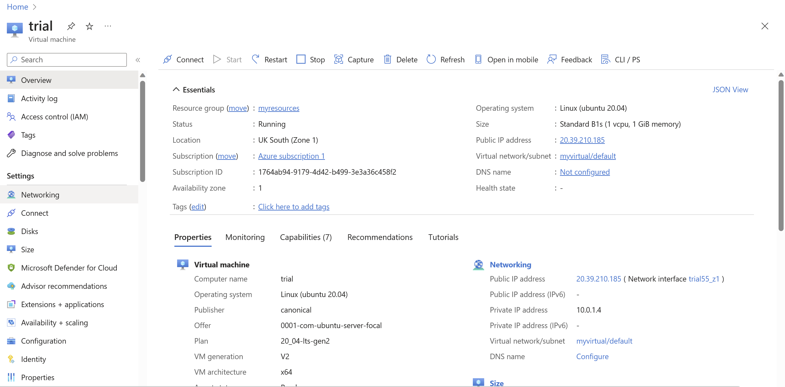
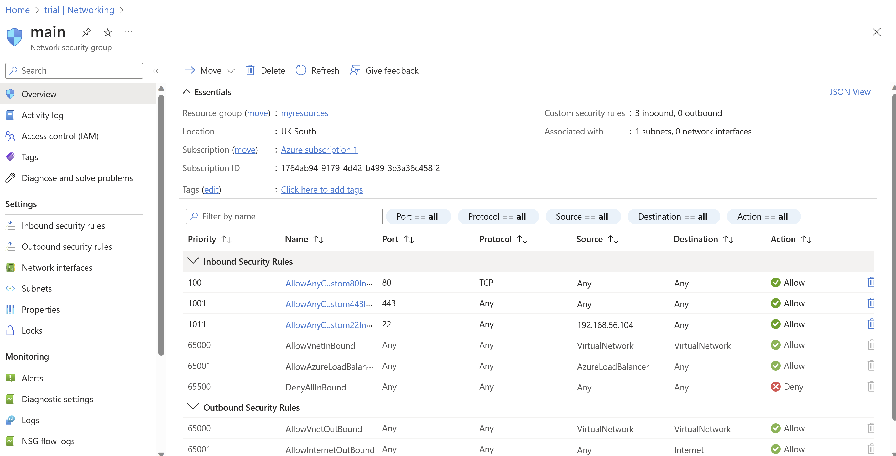
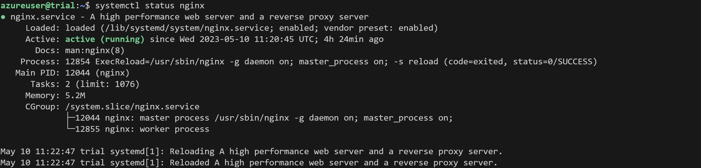
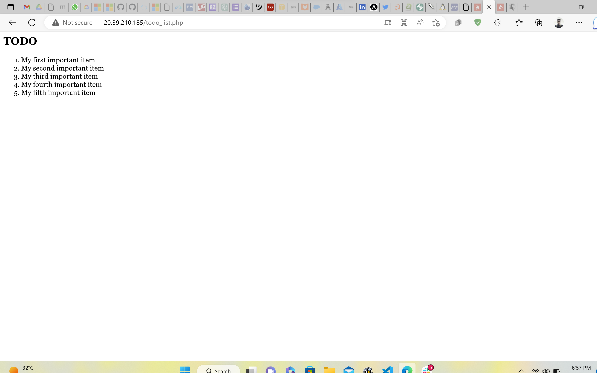

# Linux-Nginx-MySQL-PHP Stack
This project was to display data entered into tables in a MySQL (relational) database.

## Step 1: Linux Instance
A Linux virtual machine instance was spinned up on Microsoft Azure. Security groups rules were created to allow HTTP and HTTPs access on port 80 and 443 respectively, and SSH access on port 22 from my IP.





## Step 2: Installation of Nginx Web Server
Nginx web server was installed using apt package utility

```
sudo apt update
sudo apt install nginx -y
```
Nginx is shown to be active after running the following command: 
```
systemctl status nginx
```


## Step 3: Installing PHP-fpm and PHP-Mysql
For Nginx to serve PHP files, it requires an interpreter (PHP-fpm) that acts as a link. Also, PHP-MySQL enables PHP to communicate with relational databases like MySQL.

```
sudo apt install php-fpm php-mysql -y
```

## Step 4: Configuring Nginx to Use PHP Processor
Nginx has to be configured to communicate properly with the necessary PHP processes.

First a root directory was created and ownership of the directory was set to the current user:

```
sudo mkdir /var/www/projectLEMP
sudo chown -R $USER:$USER /var/www/projectLEMP
```

A configuration file was created using _nano_ text editor in the /etc/nginx/sites-available/projectLEMP path. This configuration file defines document root directory, server port, order of files to be served, and error files.

```
server {
    listen 80;
    server_name projectLEMP www.projectLEMP;
    root /var/www/projectLEMP;

    index index.html index.htm index.php;

    location / {
        try_files $uri $uri/ =404;
    }

    location ~ \.php$ {
        include snippets/fastcgi-php.conf;
        fastcgi_pass unix:/var/run/php/php8.1-fpm.sock;
     }

    location ~ /\.ht {
        deny all;
    }

}
```
Configuration was activated by linking it to the config file from Nginx’s sites-enabled directory:

```
sudo ln -s /etc/nginx/sites-available/projectLEMP /etc/nginx/sites-enabled/
```
Syntax of the configuration file was verified using

```
sudo nginx -t
```

Default Nginx host was disabled and the Nginx service was reloaded:

```
sudo unlink /etc/nginx/sites-enabled/default
sudo systemctl reload nginx
```

## Step 6: Installing and Configuring MySQL Server

MySQL server was installed, a new user was created, a database and a table were created, and data was inserted into the table.

```
sudo apt install mysql-server -y
```

Signed in as root user:

```
sudo mysql

mysql> ALTER USER 'root'@'localhost' IDENTIFIED WITH mysql_native_password BY 'password1';
```

Logged in again as the root user with the new password:

```
sudo mysql -u root -p
```

Created new user __example_user__ and database __example_database__. Granted all privileges to the new user and created the table __todo_list__.

```
sudo mysql
mysql> CREATE DATABASE example_database;

mysql> CREATE USER 'example_user'@'%' IDENTIFIED WITH mysql_native_password BY 'password';

mysql> GRANT ALL ON example_database.* TO 'example_user'@'%';
```

Created todo_list table:

```
CREATE TABLE example_database.todo_list (
mysql>     item_id INT AUTO_INCREMENT,
mysql>     content VARCHAR(255),
mysql>     PRIMARY KEY(item_id)
mysql> );
```
Inserted data into the table:

```
mysql> INSERT INTO example_database.todo_list (content) VALUES ("My first important item");
```

A PHP file (todo_list.php) in the root directory (/var/www/projectLEMP) was created to display the contents of the database:

```
<?php
$user = "example_user";
$password = "password";
$database = "example_database";
$table = "todo_list";

try {
  $db = new PDO("mysql:host=localhost;dbname=$database", $user, $password);
  echo "<h2>TODO</h2><ol>";
  foreach($db->query("SELECT content FROM $table") as $row) {
    echo "<li>" . $row['content'] . "</li>";
  }
  echo "</ol>";
} catch (PDOException $e) {
    print "Error!: " . $e->getMessage() . "<br/>";
    die();
}
```

Nginx served the file at IP/todo_list.php:

