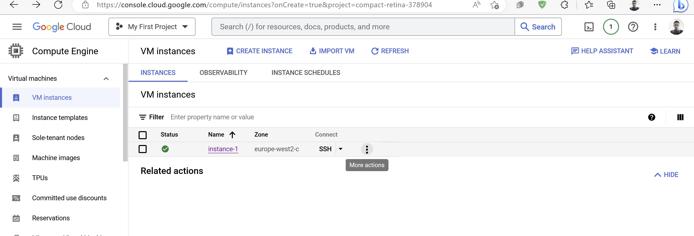

# Creating Linux Users Using Shell Script
This task was to create 20 users on a remote server using shell script and add them to the user group __developers__.

## Step 1: Genrating RSA Key
First step was to generate RSA keys and save it in the directory used for the task.

```
ssh-keygen -t rsa -f /home/davidakalugo/shell/id_rsa
```
## Step 2: Creating a names.csv file
A names.csv file including the names of the 20 users to be created on the server was also created.


## Step 3: Writing the Shell Script
A shell script (__aux.sh__) using an _if_ statement inside a _for_ loop was used for this task. The shell script was also made executable using the __chmod__ utility.
```
#!/bin/bash
groupadd developers
for name in $(cat /home/ubuntu/shell/names.csv)
do
   if grep -Fxq "$name" $(cat /etc/passwd)
   then
       break
   else
        useradd $name -g developers -m -d /home/$name -s /bin/bash
        mkdir /home/$name/.ssh
        cat /home/davidakalugo/shell/id_rsa.pub > /home/$name/.ssh/authorized_keys
   fi
done
```

```
chmod +x aux.sh
```

## Step 4: Logging in to Server as a User
After running the shell script on a Google Cloud instance (_instance-1_), I could log in as a different user--in this case, Olumide, one of the names inputed into the _names.csv_ file.



